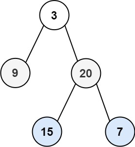

# 1.  Longest Substring Without Repeating Characters
## Problem Statement

Given a string s, find the length of the longest substring without duplicate characters.

```
Example 1:

Input: s = "abcabcbb"
Output: 3
Explanation: The answer is "abc", with the length of 3.
```

[Link to Solution](./src/main/java/LengthOfLongestSubstring.java)

`Sliding Window`

---
# 2.  Minimum Size Subarray Sum
## Problem Statement

Given an array of positive integers nums and a positive integer target, return the minimal length of a subarray whose sum is greater than or equal to target. 
If there is no such subarray, return 0 instead.
```
Example 1:

Input: target = 7, nums = [2,3,1,2,4,3]
Output: 2
Explanation: The subarray [4,3] has the minimal length under the problem constraint.

Example 2:

Input: target = 4, nums = [1,4,4]
Output: 1
```
[Link to Solution](./src/main/java/MinSubArrayLength.java)

`Sliding Window`

---
# 3 Longest Repeating Character Replacement
## Problem Statement
You are given a string s and an integer k. 
You can choose any character of the string and change it to any other uppercase English character. 
You can perform this operation at most k times.
Return the length of the longest substring containing the same letter you can get after performing the above operations.

```
Example 1:

Input: s = "ABAB", k = 2
Output: 4
Explanation: Replace the two 'A's with two 'B's or vice versa.
Example 2:

Input: s = "AABABBA", k = 1
Output: 4
Explanation: Replace the one 'A' in the middle with 'B' and form "AABBBBA".
The substring "BBBB" has the longest repeating letters, which is 4.
There may exists other ways to achieve this answer too.
```

[Link to Solution](./src/main/java/LongestRepeatingCharReplacement.java)

`Sliding Window`

---
# 4 Permutation in String
## Problem Statement
Given two strings s1 and s2, return true if s2 contains a permutation of s1, or false otherwise.
In other words, return true if one of s1's permutations is the substring of s2.

```
Example 1:

Input: s1 = "ab", s2 = "eidbaooo"
Output: true
Explanation: s2 contains one permutation of s1 ("ba").
Example 2:

Input: s1 = "ab", s2 = "eidboaoo"
Output: false
```

[Link to Solution](./src/main/java/PermutationInString.java)

`Sliding Window`

---
# 5 3Sum Problem
## Problem Statement
Given an integer array nums, return all the triplets [nums[i], nums[j], nums[k]] 
such that i != j, i != k, and j != k, and nums[i] + nums[j] + nums[k] == 0.
Notice that the solution set must not contain duplicate triplets.

```
Example 1:

Input: nums = [-1,0,1,2,-1,-4]
Output: [[-1,-1,2],[-1,0,1]]
Explanation: 
nums[0] + nums[1] + nums[2] = (-1) + 0 + 1 = 0.
nums[1] + nums[2] + nums[4] = 0 + 1 + (-1) = 0.
nums[0] + nums[3] + nums[4] = (-1) + 2 + (-1) = 0.
The distinct triplets are [-1,0,1] and [-1,-1,2].
Notice that the order of the output and the order of the triplets does not matter.
Example 2:

Input: nums = [0,1,1]
Output: []
Explanation: The only possible triplet does not sum up to 0.
Example 3:

Input: nums = [0,0,0]
Output: [[0,0,0]]
Explanation: The only possible triplet sums up to 0.
```

[Link to Solution](./src/main/java/ThreeSum.java)

`Two Pointer`

---
# 6. Binary Tree Zigzag Level Order Traversal
## Problem statement

Given the root of a binary tree, 
return the zigzag level order traversal of its nodes' values. (i.e., from left to right, then right to left for the next level and alternate between)

```
Example 1:
```


```
Input: root = [3,9,20,null,null,15,7]
Output: [[3],[20,9],[15,7]]
Example 2:

Input: root = [1]
Output: [[1]]
Example 3:

Input: root = []
Output: []
```

[Link to Solution](./src/main/java/BTZigzag.java)

`Queue, LinkedList, BSF`

---
# 7 Subarray Sum Equals K
## Problem statement
Given an array of integers nums and an integer k, return the total number of subarrays whose sum equals to k.
A subarray is a contiguous non-empty sequence of elements within an array.

```
Example 1:

Input: nums = [1,1,1], k = 2
Output: 2
Example 2:

Input: nums = [1,2,3], k = 3
Output: 2
```

[link to solution](./src/main/java/SubarraySumEqualsK.java)

`Prefix Sum, HashMap`
